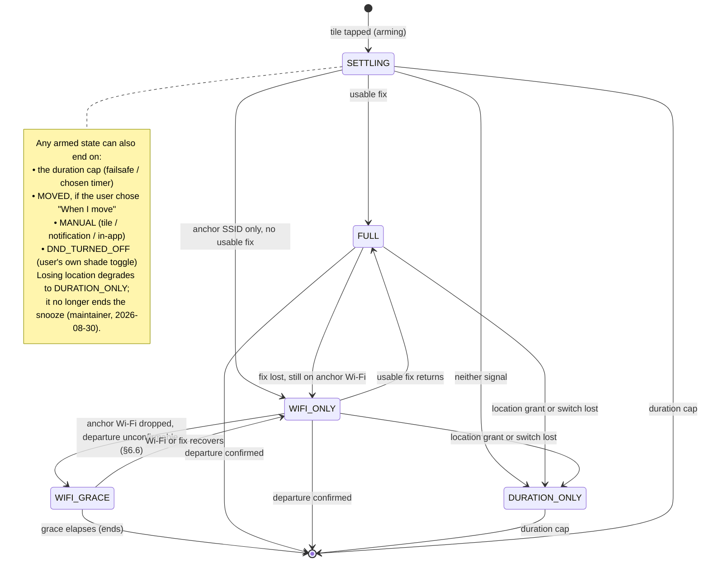
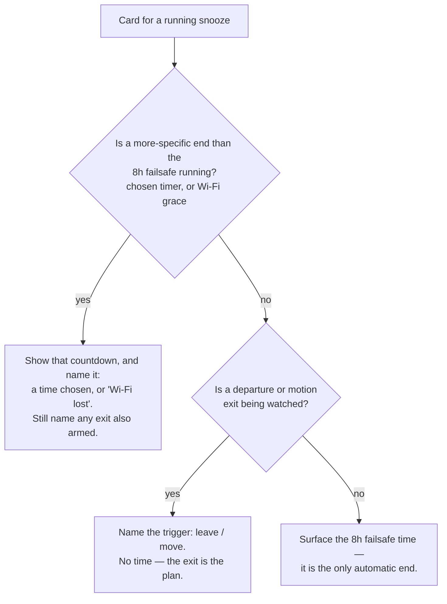

# Tracking states and what the card shows

This is the state model behind the ongoing snooze — the `TrackingMode` a snooze
runs in, how it moves between modes, and the rule that decides what each state's
card, notification and tile put in front of the user. It exists so the display
rule (SPEC.md §4.2, §4.4) can be reasoned about state by state rather than
re-derived from the code each time.

The diagrams render on GitHub directly from the Mermaid source below. Rendered
SVGs are also checked in for viewing outside GitHub —
[`tracking-states-lifecycle.svg`](./tracking-states-lifecycle.svg) and
[`tracking-states-display-rule.svg`](./tracking-states-display-rule.svg) — and
are the source of truth's *output*, not the source: edit the Mermaid blocks here,
then regenerate the SVGs with `mermaid-cli` (`mmdc -i <block>.mmd -o <file>.svg`).

## The tracking-mode lifecycle

A snooze arms into `SETTLING` (the anchor capture is still running, bounded at
10 s so arming never blocks — SPEC.md §4.1), then resolves to the most capable
mode the anchor actually supports (`TrackingMode.from`). From there it degrades —
never silently — as signals are lost, and ends on one of the exits.

Degradation carries a *reason* (`DegradationCause`) so the notification can say
which kind of degraded it is — `NO_LOCATION_FIX` (location broken) reads
differently to `FIXES_TOO_VAGUE` (location working, nothing to fix against) even
though both land in the same mode.

## The display rule

Two things go on a card: **the next trigger that moves toward un-snoozing**, and
**a time** — but the time is only shown when it is the most specific end
available. A chosen (shortened) timer is always a real deadline; the 8 h failsafe
is shown only when nothing else is watching for a way out.

The unified rule is **show the most-specific end's time; the 8 h failsafe only
when it *is* the most specific**. "Is a departure being watched" is
`effectiveMode.tracksDeparture`: true for `FULL`, `WIFI_ONLY` and `WIFI_GRACE`;
false for `DURATION_ONLY` and `SETTLING`. So the failsafe surfaces in exactly the
states where presence has no departure it can detect — which folds `SETTLING` in
with the degraded modes for free. `WIFI_GRACE` is departure-watched, so the
failsafe stays hidden — but the grace period is a nearer, real deadline, so its
own short countdown shows instead (see below).

## Per-state mapping

Ordinary snooze (`Until I leave`, no chosen time, no motion exit):

| State | Next trigger named | Time shown | Notes |
|---|---|---|---|
| `SETTLING` | Waiting for location | 8 h failsafe | can't yet tell what will be watched |
| `FULL` | leave | none | departure watched |
| `WIFI_ONLY` | leave | none | departure watched (Wi-Fi) |
| `WIFI_GRACE` | Wi-Fi lost | 5 min grace countdown — **planned, see below** | not the failsafe; recovers to `WIFI_ONLY` if Wi-Fi/fix returns |
| `DURATION_ONLY` (degraded) | timer | 8 h failsafe | location off / grant gone / no plan |

How the exit flags change it:

- **`Until (time)` chosen** — cap shortened below the failsafe. The countdown
  always shows, whatever the mode, because it is a deadline the user set. Any exit
  that survived the change (the `PARTIAL` fail-open, or a process death
  mid-replacement) is still named alongside it.
- **`When I move` chosen** — motion is an armed exit, so "move" is named and the
  failsafe stays hidden, the same shape as a departure exit — even in
  `DURATION_ONLY`, where motion is the only thing being watched.
- **Both `leave` and `move` armed** — the surfaces differ, on purpose: the main
  screen names only `move` (`Snoozing until you move` — motion is the stricter
  trigger, so it already covers leaving, SPEC §4.4); the notification names both;
  the tile names neither.

## `WIFI_GRACE` display (decided; grace countdown is a follow-up)

A departure is technically "being watched", so the 8 h failsafe stays hidden —
but the next end here is not a user action: the anchor Wi-Fi already dropped and a
short grace timeout (§6.6, `Presence.WIFI_GRACE` = 5 min) is ending the snooze
automatically unless something recovers. The decided design is for the card to
name "Wi-Fi lost" and show a **countdown to the grace deadline** — a real,
scheduled end (`graceDeadlineMs`), nearer than the failsafe, so by the unified
rule it is the time to show (maintainer, 2026-09-13). If Wi-Fi or a fix returns,
the snooze goes back to `WIFI_ONLY` and the card returns to "leave".

**Not yet implemented.** The ongoing card is built from the snooze record alone,
which does not carry the grace deadline, so threading it into the main screen and
notification is a follow-up (tracked in `TODO.md`). Until it lands the card reads
`Wi-Fi lost — ending soon` with no countdown. The countdown, when it lands, will
use the same always-hours copy as the rest of the app (`0h 4m left`); the format
lives in code and `TODO.md`, not here.
